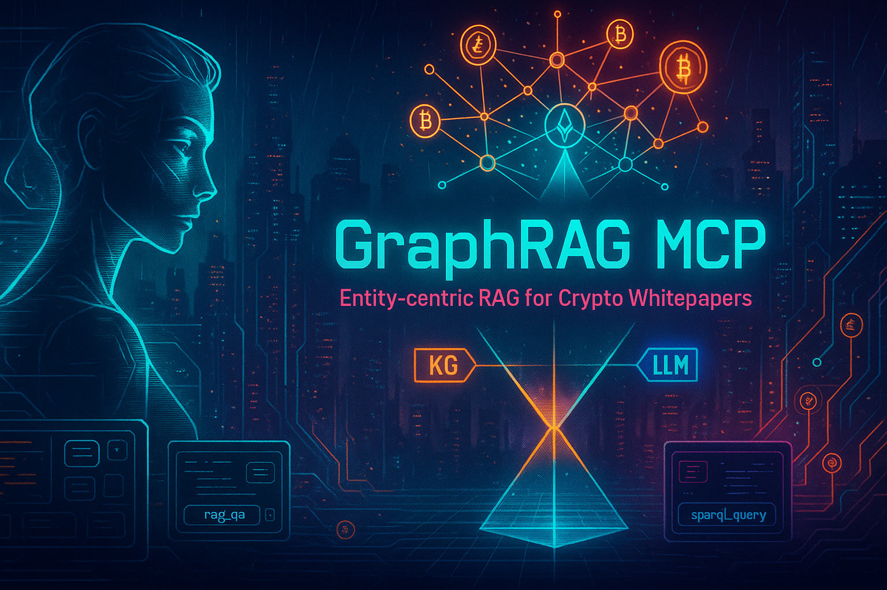

# 🧠 GraphRAG MCP  

> **Entity-centric Retrieval-Augmented Generation for Crypto Whitepapers**  
> _Local-first • Private • FastMCP-ready_

<p align="center">
  
</p>


<!-- Badges -->
      

---

## 1) ✨ Overview

**GraphRAG MCP** is a modular, **local-first** system that turns crypto whitepapers into an **entity-centric Knowledge Graph** and a **vector-searchable corpus**, then answers questions with **RAG + optional KG enrichment + LLM synthesis** — all via standardized **FastMCP** tools.

### Why this project?

- 🛡️ **Privacy by default:** runs entirely on your machine (Ollama, Chroma, GraphDB).
- ⚡ **Fast & focused:** entity-filtered retrieval narrows context to the right tokens/protocols.
- 🧩 **Composable:** exposes `rag.*` and `kg.*` tools so an **MCP Coordinator** or **Streamlit** app can orchestrate multi-tool workflows.
- 🧠 **Explainable answers:** returns **citations with doc/chunk/entity IDs** for every response.

---

### 🔁 Typical usage

1. Ingest and label whitepapers → build embeddings and insert entities.  
2. Ask questions via `rag.qa` (semantic + entity-filtered retrieval), optionally enrich with KG labels/aliases.  
3. Get concise LLM answers with inline citations to source chunks.

---

## 2️⃣ Features

### 🧩 Knowledge Graph (KG)

- **Entity-only architecture** using RDF/OWL ontologies (`mcp-core.ttl`, `mcp-crypto.ttl`).
- Built on **Ontotext GraphDB 11+** with SHACL validation and SPARQL/GraphQL endpoints.
- Stores canonical entities such as tokens, protocols, components, and organizations.
- Enables KG enrichment for RAG answers via aliases, labels, and relationships.

### 🔍 Vector Retrieval (RAG)

- **ChromaDB** acts as the persistent vector store for chunk embeddings.
- Embeddings generated using **Ollama’s** `nomic-embed-text` model.
- Supports **semantic** and **entity-filtered** retrieval modes for accurate context fetching.
- Each chunk contains structured metadata: `doc_id`, `chunk_id`, `entity_ids`, `section_type`, and `page`.

### 🧠 Local LLM Inference

- Uses **Ollama** for fully local inference — no external API keys required.
- Compatible with models like `llama3.1:latest`, `qwen2.5:14b-instruct`, or `mistral`.
- Performs labeling, summarization, and final QA synthesis.
- Includes deterministic **mock mode** for offline testing and CI.

### ⚙️ FastMCP Servers

- Two modular servers expose tools via **FastMCP 2.x**:
  - `rag` → `rag.search`, `rag.embed_and_index`, `rag.reindex`, `rag.delete`, `rag.health`, `rag.qa`
  - `kg` → `sparql_query`, `sparql_update`, `push_labels`, `validate_labels`, `list_documents`, `kg.health`
- Both run locally via stdio and are MCP-Coordinator compatible.

### 🔒 Privacy & Portability

- 100% offline operation — suitable for air-gapped or research environments.
- Reproducible local stack (GraphDB + Chroma + Ollama + FastMCP).
- Works seamlessly on Windows 11, macOS, or Linux.

### 🚀 Integration Ready

- Plug-and-play with **MCP Coordinators** or **Streamlit apps** for end-user Q&A.
- Can interoperate with other MCPs such as:
  - Brave API MCP (web search)
  - MongoDB MCP (strategy data)
  - Telegram MCP (messaging)
  - Gmail MCP (email retrieval)
- Returns clean JSON outputs for easy chaining into agentic workflows.

---

## 3️⃣ 🏗️ Architecture

The **GraphRAG MCP** architecture combines **Knowledge Graph reasoning**, **Vector-based retrieval**, and **Local LLM synthesis** — all under the **MCP** interoperability standard.  
It’s designed for *clarity*, *privacy*, and *modular scalability*.

---

### 🧭 High-Level Overview

| Layer | Technology | Purpose | Example Components |
|:------|:------------|:---------|:--------------------|
| 🗂 **Ingestion Layer** | Python + LangChain | Reads PDFs, splits into semantic chunks, labels with LLMs | `pdf_reader.py`, `semantic_splitter.py`, `llm_chunk_tagger.py` |
| 🧩 **Knowledge Graph Layer (KG)** | GraphDB (Ontotext) + RDFLib | Stores canonical entities (tokens, protocols, organizations) | `graphdb_sink.py`, `namespaces.py`, SHACL shapes |
| 💾 **Vector Retrieval Layer (RAG)** | ChromaDB + Ollama embeddings | Stores text chunks + metadata + embeddings for semantic retrieval | `chroma_store.py`, `.chroma/` |
| ⚙️ **MCP Layer** | FastMCP 2.x | Exposes standardized MCP tools (`rag.*`, `kg.*`) | `rag_server.py`, `kg_server.py` |
| 🧠 **LLM Synthesis Layer** | Ollama LLMs (`llama3.1`, `qwen2.5`) | Answers questions with retrieved context + KG enrichment | `rag.qa`, `llm_chunk_tagger` |
| 💬 **User Interface Layer** | MCP Coordinator / Streamlit | Connects multiple MCPs for conversational Q&A | Coordinator UI or custom Streamlit dashboard |

---

### 🔹 Data Flow Diagram

```text
            ┌────────────────────────────────────────┐
            │              Whitepapers               │
            │ (PDFs, research papers, documentation) │
            └───────────────────┬────────────────────┘
                                │
                                ▼
            ┌─────────────────────────────────────────────┐
            │      📄 Ingestion & Labeling                │
            │  pdf_reader → semantic_splitter →           │
            │  llm_chunk_tagger → postprocess             │
            └───────────────────┬─────────────────────────┘
                                 │
                        ┌────────┴────────┐
                        │                 │
                        ▼                 ▼
            ┌────────────────┐    ┌──────────────────────┐
            │ 🧠 GraphDB KG  │    │ 💾 Chroma RAG      │
            │ Entities & IRIs │   │ Chunks + Embeddings │
            └────────┬────────┘   └────────┬────────────┘
                     │                     │
                     ▼                     ▼
               ┌───────────────┐      ┌───────────────┐
               │ ⚙️ kg_server  │     │ ⚙️ rag_server │
               │ (FastMCP)     │      │ (FastMCP)     │
               └────────┬──────┘      └──────┬────────┘
                        │                    │
                        └────────┬───────────┘
                                 ▼
                  ┌────────────────────────────────┐
                  │ 💬 MCP Coordinator / Streamlit │
                  │  User-facing Q&A Interface     │
                  └────────────────────────────────┘

```

---

### 🧠 How It Works (Step-by-Step)

| Step | Description | Input | Output |
|:----:|:-------------|:------|:--------|
| **1️⃣** | **PDF Parsing** | Whitepaper PDF | Raw text pages |
| **2️⃣** | **Semantic Splitting** | Raw text | Meaningful chunks (by section/topic) |
| **3️⃣** | **LLM Labeling** | Chunk text | Entities, relations, and section labels |
| **4️⃣** | **Postprocessing** | Labeled chunks | Cleaned JSONL with canonical entity IRIs |
| **5️⃣** | **Indexing** | JSONL labels | Chroma embeddings + KG triples |
| **6️⃣** | **Retrieval (rag.search)** | Query text / entities | Relevant chunks |
| **7️⃣** | **Enrichment (optional)** | Retrieved entities | KG aliases, definitions |
| **8️⃣** | **Answer Synthesis (rag.qa)** | Question + context | Concise answer with citations |

---

### 🌐 Data Modalities

| Data Type | Storage | Example |
|:-----------|:--------|:--------|
| 🧱 **Entity** | GraphDB | `<https://kg.mcp.ai/id/token/bitcoin>` → `rdf:type crypto:Token` |
| 📜 **Chunk** | Chroma | “Bitcoin is a peer-to-peer electronic cash system…” |
| 🧩 **Embedding** | Chroma / Ollama | 768-dim `nomic-embed-text` vector |
| 🧮 **Provenance** | Metadata | `doc_id`, `chunk_id`, `page`, `entity_ids[]` |
| 💬 **Answer** | MCP JSON | `{ "answer": "...", "citations": [...] }` |

---

### 🧱 Core MCP Tools

| Server | Tool | Description |
|:--------|:------|:-------------|
| 🧩 **RAG** | `rag.search` | Semantic search over chunks |
| | `rag.embed_and_index` | Add new labeled chunks to index |
| | `rag.reindex` | Rebuild from outputs directory |
| | `rag.delete` | Delete by IDs or filters |
| | `rag.qa` | Question answering with LLM synthesis |
| | `rag.health` | Diagnostics and store info |
| 🧠 **KG** | `sparql_query` / `sparql_update` | Execute SPARQL against GraphDB |
| | `push_labels` / `validate_labels` | Add or validate KG entries |
| | `list_documents`, `get_chunk` | Retrieve document metadata |
| | `kg.health` | Check GraphDB repository status |

---

## 4️⃣ ⚙️ Installation & Setup

Set up your local **GraphRAG MCP environment** in just a few steps!  
This stack runs fully offline and integrates seamlessly with **Ollama**, **GraphDB**, and **Chroma**.

---

### 🧾 Prerequisites

| Requirement | Description | Example |
|:-------------|:-------------|:----------|
| 🐍 **Python** | Version **3.11+** recommended | `python --version` → `Python 3.11.8` |
| 🧠 **Ollama** | Local LLM runtime (for inference + embeddings) | `ollama pull llama3.1:latest` |
| 🧩 **GraphDB Desktop 11+** | Local Knowledge Graph database | runs at `http://localhost:7200` |
| 💾 **ChromaDB** | Vector store for embeddings | auto-initialized under `.chroma/` |
| 🧰 **FastMCP** | Multi-Component Platform runtime (2.x) | installed via `pip` |

---

### 🧱 Folder Layout (simplified)

| Folder | Purpose | Example Contents |
|:--------|:----------|:----------------|
| `src/` | Core codebase | `pipeline.py`, `mcp/`, `kg/`, `rag/` |
| `outputs/run_simple/` | Generated outputs | labeled chunks, reports, embeddings |
| `.chroma/` | Chroma persistent vector store | `chroma.sqlite3`, `index/` |
| `.env` | Environment configuration | Ollama, GraphDB, Chroma settings |
| `tests/` | Offline unit tests | `test_rag_qa.py`, `test_kg_server.py` |

---

### 🧰 Step-by-Step Setup

#### 🪄 1️⃣ Clone & Create Virtual Environment

```bash
git clone <[text](https://github.com/Swissbit92/GraphDB_Desktop.git)>
```

#### ⚡ 2️⃣ Activate Environment

| OS | Command |
|:---|:---------|
| 🪟 **Windows (PowerShell)** | `.venv\Scripts\activate` |
| 🐧 **Linux / macOS** | `source .venv/bin/activate` |

#### 📦 3️⃣ Install Dependencies

```bash
pip install -r requirements.txt
```

#### ⚙️ 4️⃣ Verify Installation

```bash
python -m src.mcp.rag_server --list-tools
python -m src.mcp.kg_server --list-tools
```

✅ You should see tools like **`rag.qa`**, **`rag.search`**, and **`kg.health`**.

---

### 🧠 Optional: Preload Ollama Models

| Model | Purpose | Pull Command |
|:-------|:----------|:--------------|
| 🦙 **llama3.1:latest** | Default reasoning + summarization model | `ollama pull llama3.1:latest` |
| 🧩 **nomic-embed-text** | Embedding model for RAG vectorization | `ollama pull nomic-embed-text` |
| 🤖 **qwen2.5:14b-instruct** | Larger model for complex QA tasks | `ollama pull qwen2.5:14b-instruct` |

---

### 🔍 Quick Sanity Check

Run a quick health diagnostic to ensure everything is configured correctly:

```bash
pytest -q
python -m src.mcp.rag_server --run-tool rag.health
python -m src.mcp.kg_server --run-tool kg.health
```

If both return ✅ **OK**, you’re ready to run the pipeline and start querying your **Knowledge Graph + RAG** system!

---

## 5️⃣ 🧪 How to Use & Test

### 📥 Ingest Whitepapers & Build the Index

```bash
# Place your PDFs under .\whitepapers\ then run:
python -m src.pipeline --input ".\whitepapers\*.pdf"
```

✅ Outputs:

- Labeled JSONL → `outputs\run_simple\labels\`
- Chroma index  → `.chroma\`
- (If enabled) Entities pushed to GraphDB repository `mcp_kg`

---

### 🖧 Start the MCP Servers (RAG + KG)

```bash
# Terminal A
python -m src.mcp.rag_server
```

```bash
# Terminal B
python -m src.mcp.kg_server
```

💡 Tip: In another PowerShell window, confirm the tools are available:

```bash
python -m src.mcp.rag_server --list-tools
python -m src.mcp.kg_server --list-tools
```

---

### 🔎 Quick Retrieval Check (RAG)

```bash
# Example: semantic search for "peer-to-peer electronic cash"
python -m src.mcp.rag_server --run-tool rag.search --input '{ "text": "peer-to-peer electronic cash", "k": 3 }'
```

You should see matching chunks with `doc_id`, `chunk_id`, and distances.

---

### ❓ Ask Questions with Citations (rag.qa)

```bash
# Fully offline (deterministic mock answer)
python -m src.mcp.rag_server --run-tool rag.qa --input '{ "question": "What problem does Bitcoin aim to solve?", "k": 5, "kg_enrich": true, "use_mock_llm": true }'
```

➡️ Returns:

- `answer`: concise response (mock or LLM)
- `citations`: `[ {doc_id, chunk_id, entity_ids, text} ]`
- `took_ms`, `model_used`

Switch to real LLM synthesis by omitting `use_mock_llm` (requires Ollama running).

---

### 🧠 Optional: Entity-Filtered QA

```bash
python -m src.mcp.rag_server --run-tool rag.qa --input '{ "question": "How does proof-of-work secure the network?", "entity_ids": ["https://kg.mcp.ai/id/token/bitcoin"], "k": 5, "kg_enrich": true, "use_mock_llm": true }'
```

This restricts retrieval to chunks tagged with the specified KG entity(ies).

---

### 🧪 Run the Test Suite

```bash
pytest -q
```

Key tests (all offline):

- `tests\test_rag_qa.py`: verifies retrieval normalization and mock LLM mode  
- `tests\test_kg_server.py`: checks KG connectivity (skips if GraphDB not running)

---

### 🩺 Health Checks

```bash
python -m src.mcp.rag_server --run-tool rag.health
python -m src.mcp.kg_server --run-tool kg.health
```

Expect collection info, document counts, and OK status.

---

### 🧩 MCP Coordinator / UI Hookup (Optional)

Ensure your `mcp.json` references the running servers:

```json
{
  "mcpServers": {
    "rag": { "command": "python", "args": ["-m", "src.mcp.rag_server"] },
    "kg":  { "command": "python", "args": ["-m", "src.mcp.kg_server"] }
  }
}
```

Then connect via your MCP Coordinator or Streamlit app to interactively call `rag.qa` and `kg.*` tools.

---

## 🙏 Closing Words

GraphRAG MCP is part of the broader **Eeva AI** ecosystem — an open, modular framework for intelligent crypto research and strategy generation.  
This project wouldn’t exist without the incredible open-source community that continues to push the boundaries of local AI and knowledge engineering.

If you find this useful:

- ⭐ **Star the repository** to support ongoing development  
- 🧩 **Contribute** improvements or new MCP modules  
- 🧠 **Explore** integrations with other MCPs (Brave API, MongoDB, Telegram, etc.)  
- 💬 **Share feedback** — every suggestion helps make the system smarter, faster, and more reliable

---

> _“Knowledge is only powerful when it’s connected.”_  
> — __Eeva AI Research__

Thank you for being part of the open-source journey. 🚀

---
